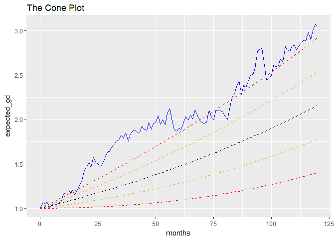

# Cone Plot
Karl Polen  
July 13, 2016  

Demonstrates creation of a cone plot in ggplot2.

A convenience function coneplot has been added to basic financial.r


```r
require(ggplot2)
#the data
#pdf("cone plots.pdf",height=9,width=6)
par(mfrow=c(2,1))
expected_return=-1+exp(log(1.08)/12)
standard_deviation=.12/sqrt(12)
n=120
months=0:n
actual_return=rnorm(n,expected_return,standard_deviation)
expected_gd=c(1,exp(cumsum(rep(log(1+expected_return),n))))
actual_gd=c(1,exp(cumsum(log(1+actual_return))))
one_sigma_up=expected_gd+(standard_deviation*months/sqrt(n))
two_sigma_up=expected_gd+(2*standard_deviation*months/sqrt(n))
one_sigma_down=expected_gd-(standard_deviation*months/sqrt(n))
two_sigma_down=expected_gd-(2*standard_deviation*months/sqrt(n))
conedf=data.frame(months,expected_gd,actual_gd,one_sigma_up,two_sigma_up,
                  one_sigma_down,two_sigma_down)
#the plot
ggplot(conedf,(aes(x=months)))+
  geom_line(linetype=2,colour='black',aes(y=expected_gd))+
  geom_line(colour='blue',aes(y=actual_gd))+
  geom_line(linetype=2,colour='orange',aes(y=one_sigma_up))+
  geom_line(linetype=2,colour='orange',aes(y=one_sigma_down))+
  geom_line(linetype=2,colour='red',aes(y=two_sigma_up))+
  geom_line(linetype=2,colour='red',aes(y=two_sigma_down))
```

<!-- -->

```r
#make a convenience function
coneplot=function(return,annual_expected_return,annual_standard_deviation,periodicity=c('y','q','m')) {
  #
  # return is a time series of monthly, quarterly or annual arithmetic return values
  # annual_expected_return is the annual expected return for the strategy
  # annual_standard_deviation is the expected annual volatility
  # periodicity is 'y', 'q' or 'm' indicating yearly, quarter or monthly data
  #
  n=length(return)
  months=0:n
  if(periodicity=='y') {
    expected_return=annual_expected_return
    standard_deviation=annual_standard_deviation
  }
  if(periodicity=='q') {
    expected_return=-1+exp(log(1+annual_expected_return)/4)
    standard_deviation=annual_standard_deviation/sqrt(4)
  }
  if(periodicity=='m') {
    expected_return=-1+exp(log(1+annual_expected_return)/12)
    standard_deviation=annual_standard_deviation/sqrt(12)
  }
  expected_gd=c(1,exp(cumsum(rep(log(1+expected_return),n))))
  actual_gd=c(1,exp(cumsum(log(1+actual_return))))
  one_sigma_up=expected_gd+(standard_deviation*months/sqrt(n))
  two_sigma_up=expected_gd+(2*standard_deviation*months/sqrt(n))
  one_sigma_down=expected_gd-(standard_deviation*months/sqrt(n))
  two_sigma_down=expected_gd-(2*standard_deviation*months/sqrt(n))
  conedf=data.frame(months,expected_gd,actual_gd,one_sigma_up,two_sigma_up,
                    one_sigma_down,two_sigma_down)
  x=ggplot(conedf,(aes(x=months)))+
    geom_line(linetype=2,colour='black',aes(y=expected_gd))+
    geom_line(colour='blue',aes(y=actual_gd))+
    geom_line(linetype=2,colour='orange',aes(y=one_sigma_up))+
    geom_line(linetype=2,colour='orange',aes(y=one_sigma_down))+
    geom_line(linetype=2,colour='red',aes(y=two_sigma_up))+
    geom_line(linetype=2,colour='red',aes(y=two_sigma_down))
  return(x)
}

theplot=coneplot(actual_return,.08,.12,'m')
theplot+ggtitle("The Cone Plot")
```

<!-- -->

```r
#dev.off()
```
